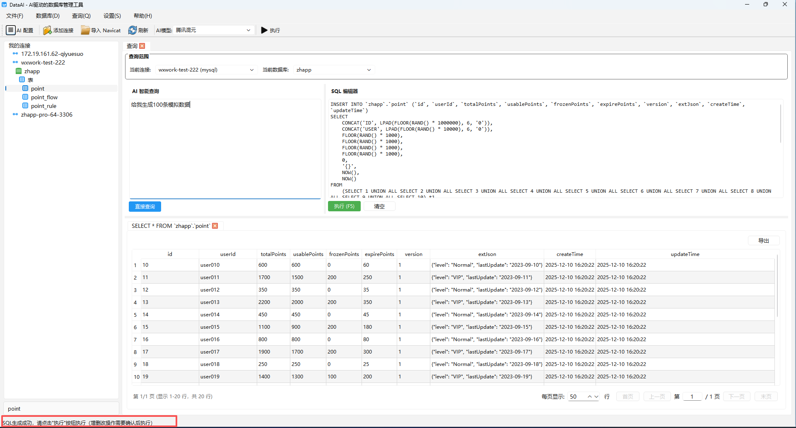
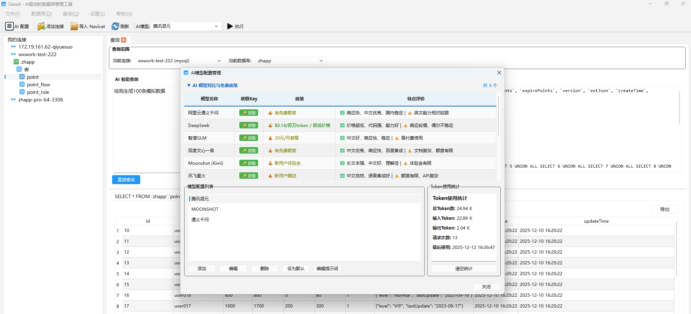
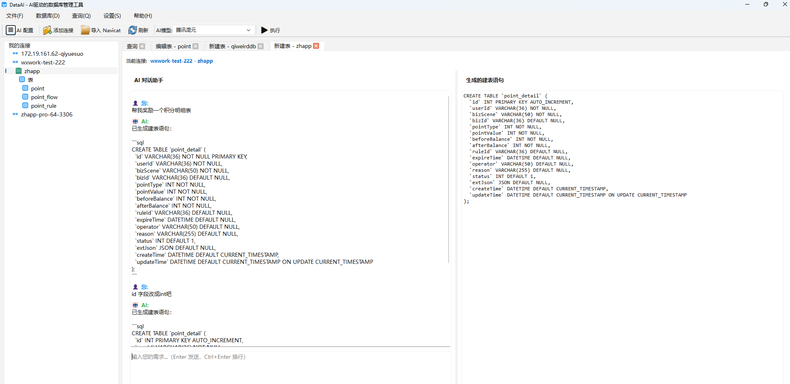
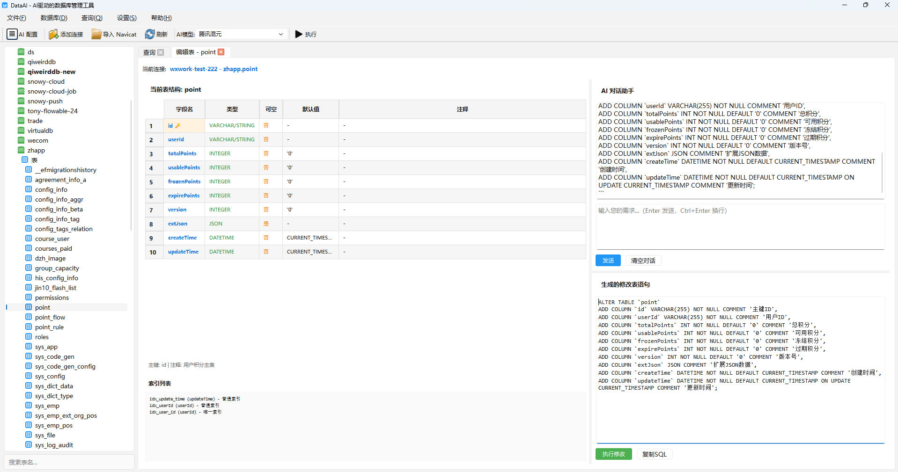
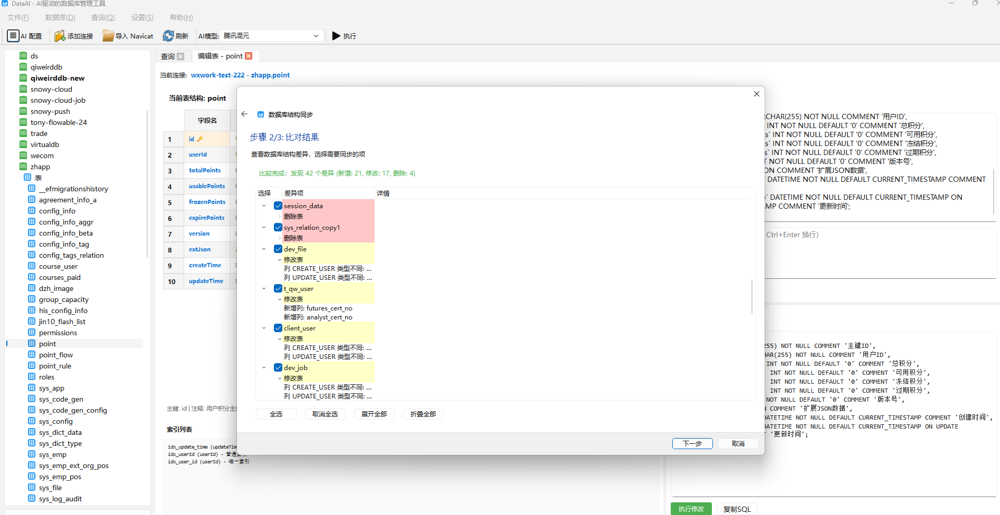

# DataAI - AI-Powered Database Management Tool

A database management tool similar to DataGrip, supporting multiple database connections and SQL queries.
download : https://gitee.com/CodeYG/db-ai-pro/releases/tag/v1.1.0

**Author**: codeyG (550187704@qq.com)

## Features

- ✅ **Multi-Database Support**
  - MySQL / MariaDB
  - PostgreSQL
  - SQLite
  - Oracle
  - SQL Server

- ✅ **Database Connection Management**
  - Add/Edit/Delete database connections
  - Connection testing
  - Connection list management
  - **Import connections from Navicat** 🆕

- ✅ **SQL Query Features**
  - SQL editor (with syntax highlighting)
  - Execute queries (SELECT)
  - Execute non-query statements (INSERT/UPDATE/DELETE)
  - Query results displayed in tables
  - Result export (CSV)

- ✅ **AI-Powered SQL Generation** 🤖
  - Generate SQL queries from natural language descriptions
  - AI-assisted table creation (smart recognition of existing table naming conventions and design patterns)
  - AI-assisted table structure editing (maintains consistency with existing table styles)
  - Database-aware SQL generation (adapts to different database types)
  - Intelligently references existing table structures to maintain overall design consistency

- ✅ **User Interface**
  - Modern PyQt6 interface
  - Split panel layout
  - Connection tree view
  - Result table display
  - **Multi-language support** (English/Chinese) 🌐

## Feature Showcase

### 1. SQL Query & AI-Powered Generation

Supports both traditional SQL editor and AI natural language queries. AI automatically analyzes table structures and generates accurate SQL statements.



**Key Features**:
- 🔹 SQL syntax highlighting editor
- 🔹 AI natural language to SQL (supports English and Chinese)
- 🔹 Multi-tab result display
- 🔹 Direct result editing (auto-generates UPDATE statements)
- 🔹 Data export (CSV, Excel, JSON)
- 🔹 Result table with sorting and filtering

### 2. AI Model Configuration

Support multiple AI model configurations, compatible with OpenAI API format (supports local models like Ollama).



**Configuration Options**:
- 🔹 Model name and API settings
- 🔹 Token usage statistics
- 🔹 Multi-model switching
- 🔹 Custom API endpoints (supports local models)

### 3. AI Multi-Turn Dialogue for Table Creation

Create database tables quickly through natural language conversation. AI automatically identifies the current database type and generates compliant table creation scripts.



**Smart Features**:
- 🔹 Multi-turn conversational interaction (supports iterative requirement refinement)
- 🔹 Automatic database type detection (MySQL/PostgreSQL/SQLite, etc.)
- 🔹 **Smart Pattern Recognition**: AI automatically analyzes existing tables in the database to learn naming conventions, field type preferences, and primary key patterns
- 🔹 **Reference Table Styles**: Selects most relevant existing tables as references when creating new tables, maintaining design consistency across the database
- 🔹 Intelligent field type recommendations (based on field type choices in reference tables)
- 🔹 Auto-generates primary keys, indexes, and constraints (following existing table patterns)
- 🔹 Database-compliant table creation statements
- 🔹 One-click table creation execution

### 4. Table Structure Editor and Management

Visual table structure editing with AI-assisted quick table creation and field modification.



**Editing Features**:
- 🔹 Field management (add/delete/modify)
- 🔹 Data type selection (adapts to different databases)
- 🔹 Index management
- 🔹 **AI Smart Table Modification**: Intelligently generates ALTER TABLE statements based on current table structure and natural language descriptions
- 🔹 **Style Consistency**: Maintains consistent naming conventions and type choices with existing table structures when modifying tables
- 🔹 **Copyable Information** 🆕: Table name, field info, etc. can be selected and copied, with right-click menu to copy selected or all fields
- 🔹 SQL preview and execution

**Table Management**:
- 🔹 Right-click table nodes for various operations
- 🔹 **Delete Table** 🆕: Double confirmation mechanism for safely deleting unwanted tables
- 🔹 Copy table structure
- 🔹 Query table data in new tab

### 5. Table Structure Synchronization

Synchronize table structures between multiple databases with batch operations support.



**Sync Features**:
- 🔹 Source and target database selection
- 🔹 Table structure difference comparison
- 🔹 Batch sync multiple tables
- 🔹 SQL script generation
- 🔹 Safe change preview

## Usage

### 1. Add Database Connection

**Method 1: Manual Addition**
1. Click menu "File" -> "Add Database Connection" or the "Add Connection" button on the toolbar
2. Fill in connection information:
   - Connection name (custom)
   - Database type
   - Host address
   - Port
   - Database name
   - Username
   - Password
3. Click "OK" to save the connection

**Method 2: Import from Navicat** 🆕
1. Click menu "File" -> "Import from Navicat" or the "Import Navicat" button on the toolbar
2. In the import dialog:
   - Click "Auto-detect Navicat Connections" to automatically import from registry or config files (Windows)
   - Or click "Import from .ncx File" to select a Navicat exported `.ncx` file
3. Select the connections to import (multiple selection supported)
4. Click "OK" to import the selected connections

**How to Export Connections from Navicat**:
- In Navicat, select "File" -> "Export Connection" or "Tools" -> "Export Connection"
- Select the connections to export, save as `.ncx` file
- Select this `.ncx` file in this tool to import

**Note**: 
- Windows systems automatically read Navicat connections from the registry
- Supports importing Navicat exported `.ncx` file format
- Some versions of Navicat passwords may not be automatically decrypted, requiring manual password entry

### 2. Execute SQL Queries

1. Select a database connection in the connection tree
2. Enter SQL statements in the SQL editor
3. Press `F5` or click the "Execute" button to run the query
4. Query results will be displayed in the result table below

### 3. AI-Powered SQL Generation 🤖

1. Enter your query description in natural language in the AI input box
2. The AI will automatically:
   - Select relevant tables
   - Analyze table structures
   - Generate accurate SQL statements
3. The generated SQL will be automatically executed and results displayed

**Features**:
- **Smart Table Selection**: If there's already SQL in the editor and you don't specify a table name (e.g., "query name field", "add condition"), AI will prioritize using tables from the editor instead of selecting new ones
- Database-aware: SQL syntax adapts to the database type (MySQL, PostgreSQL, etc.)
- Table structure analysis: Automatically uses correct table and column names
- Enum field detection: Identifies and uses correct enum values

**Tips**:
- 💡 After viewing a table's data, you can directly input short commands like "only show active", "sort by time", and AI will generate SQL based on the current table
- 💡 If you need to query other tables, explicitly specify the table name, e.g., "query users table"

### 4. Manage Connections

- **Edit Connection**: Right-click connection -> "Edit"
- **Test Connection**: Right-click connection -> "Test Connection"
- **Delete Connection**: Right-click connection -> "Delete"

### 5. Language Settings 🌐

1. Click menu "Settings" -> "Settings"
2. Select your preferred language (English/Chinese)
3. Restart the application for changes to take effect

**Note**: Language settings are stored in the Windows Registry (Windows) or configuration file (other platforms).

## Technology Stack

- **GUI Framework**: PyQt6
- **Database**: SQLAlchemy
- **Data Validation**: Pydantic
- **Password Decryption**: cryptography (for Navicat import)
- **AI Integration**: OpenAI API compatible
- **Internationalization**: Custom i18n system (JSON/TS file support)
- **Python Version**: >= 3.8

## Project Structure

```
gui-app/
├── src/
│   ├── main.py                    # Application entry point
│   ├── core/                      # Core business logic
│   │   ├── database_connection.py # Database connection model
│   │   ├── database_manager.py   # Database manager
│   │   ├── ai_client.py          # AI client for SQL generation
│   │   └── i18n.py               # Internationalization
│   ├── gui/                       # GUI components
│   │   ├── main_window.py        # Main window
│   │   ├── dialogs/              # Dialogs
│   │   │   ├── connection_dialog.py  # Connection configuration dialog
│   │   │   ├── import_dialog.py      # Import connection dialog 🆕
│   │   │   └── settings_dialog.py   # Settings dialog
│   │   └── widgets/              # Custom widgets
│   │       ├── sql_editor.py     # SQL editor
│   │       └── result_table.py   # Result table
│   ├── config/                    # Configuration management
│   │   └── settings.py
│   └── utils/                     # Utility functions
│       ├── helpers.py
│       ├── navicat_importer.py   # Navicat importer 🆕
│       └── registry_helper.py   # Windows registry helper
├── tests/                         # Test code
├── resources/                     # Resource files
│   └── translations/             # Translation files
└── requirements.txt              # Dependencies
```

## Installation

1. Create a virtual environment (recommended):
```bash
python -m venv venv
source venv/bin/activate  # Linux/Mac
# or
venv\Scripts\activate  # Windows
```

2. Install dependencies:
```bash
pip install -r requirements.txt
```

**Note**: Depending on the database type you use, you may need to install the corresponding driver:
- MySQL: `pymysql` (included)
- PostgreSQL: `psycopg2-binary` (included)
- Oracle: `cx-Oracle` (optional)
- SQL Server: `pyodbc` (included)

## Running

```bash
python src/main.py
```

## Development

### Run Tests
```bash
pytest
```

### Code Formatting
```bash
black src/
```

### Code Linting
```bash
flake8 src/
```

## Version Updates

### Latest Updates

- **AI-Powered SQL Generation**: Natural language to SQL conversion
- **Database Type Awareness**: SQL generation adapts to different database types
- **Multi-language Support**: English and Chinese interface
- **Navicat Import**: Import database connections from Navicat

### v0.2.0

- **Enhanced Query Result Table**
  - Support **direct cell editing** in result table, automatically generates and executes `UPDATE` SQL, synchronizes database updates
  - Support **multi-row selection** and right-click delete selected data, with confirmation dialog before deletion
  - New right-click menu items:
    - **View JSON Data**: View complete JSON data of current row
    - **Set to NULL**: Batch set selected cells to `NULL` and update to database
  - Optimized result table selection style: current row light color, highlighted cell color darker

- **Unified Status Bar**
  - All query/edit/delete status information unified display in **main window bottom status bar**
  - SQL editor and result area internal status bars hidden, interface cleaner

- **Packaging and Version**
  - Default use **MIT License** open source
  - Version number updated to `0.2.0`, preparing for future binary releases (such as `DataAI.exe`)

## Feature Roadmap

- [x] Import connections from Navicat 🆕
- [x] AI-powered SQL generation 🤖
- [x] Multi-language support 🌐
- [x] Database type awareness in AI prompts
- [ ] SQL syntax highlighting
- [ ] Query history
- [ ] Database table structure browsing
- [ ] Data export (Excel, JSON)
- [ ] Connection configuration save to file
- [ ] Multi-tab support
- [ ] SQL auto-completion
- [ ] Query plan analysis

## License

MIT License

## Contributing

Welcome to submit Issues and Pull Requests!
